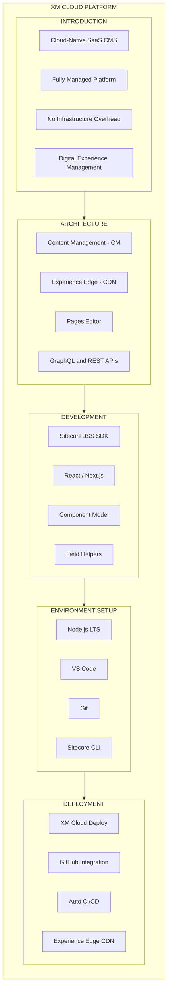
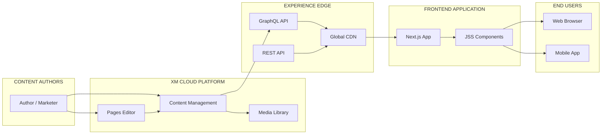
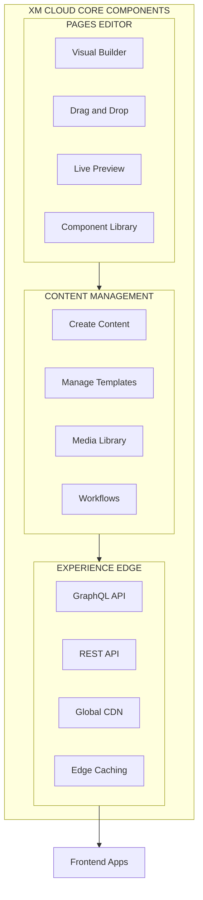
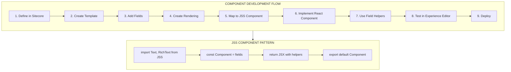
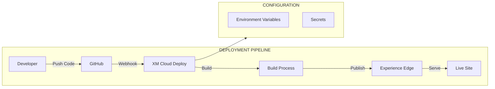

# XM Cloud Fundamentals - Visual Diagrams

## Platform Overview

```mermaid
flowchart TD
    subgraph XMCloud["XM CLOUD PLATFORM"]
        direction TB
        
        subgraph Intro["INTRODUCTION"]
            A1["Cloud-Native SaaS CMS"]
            A2["Fully Managed Platform"]
            A3["No Infrastructure Overhead"]
            A4["Digital Experience Management"]
        end
        
        subgraph Arch["ARCHITECTURE"]
            B1["Content Management - CM"]
            B2["Experience Edge - CDN"]
            B3["Pages Editor"]
            B4["GraphQL and REST APIs"]
        end
        
        subgraph Dev["DEVELOPMENT"]
            C1["Sitecore JSS SDK"]
            C2["React / Next.js"]
            C3["Component Model"]
            C4["Field Helpers"]
        end
        
        subgraph Setup["ENVIRONMENT SETUP"]
            D1["Node.js LTS"]
            D2["VS Code"]
            D3["Git"]
            D4["Sitecore CLI"]
        end
        
        subgraph Deploy["DEPLOYMENT"]
            E1["XM Cloud Deploy"]
            E2["GitHub Integration"]
            E3["Auto CI/CD"]
            E4["Experience Edge CDN"]
        end
    end
    
    Intro --> Arch
    Arch --> Dev
    Dev --> Setup
    Setup --> Deploy
```

## Architecture Flow

```mermaid
flowchart LR
    subgraph Authors["CONTENT AUTHORS"]
        Author["Author / Marketer"]
    end
    
    subgraph Platform["XM CLOUD PLATFORM"]
        CM["Content Management"]
        Pages["Pages Editor"]
        Media["Media Library"]
    end
    
    subgraph Edge["EXPERIENCE EDGE"]
        GQL["GraphQL API"]
        REST["REST API"]
        CDN["Global CDN"]
    end
    
    subgraph App["FRONTEND APPLICATION"]
        Next["Next.js App"]
        JSS["JSS Components"]
    end
    
    subgraph Users["END USERS"]
        Browser["Web Browser"]
        Mobile["Mobile App"]
    end
    
    Author --> CM
    Author --> Pages
    CM --> Media
    CM --> GQL
    Pages --> CM
    GQL --> CDN
    REST --> CDN
    CDN --> Next
    Next --> JSS
    JSS --> Browser
    JSS --> Mobile
```

## Core Components

```mermaid
flowchart TD
    subgraph Components["XM CLOUD CORE COMPONENTS"]
        subgraph CM["CONTENT MANAGEMENT"]
            CM1["Create Content"]
            CM2["Manage Templates"]
            CM3["Media Library"]
            CM4["Workflows"]
        end
        
        subgraph EdgeComp["EXPERIENCE EDGE"]
            E1["GraphQL API"]
            E2["REST API"]
            E3["Global CDN"]
            E4["Edge Caching"]
        end
        
        subgraph PagesComp["PAGES EDITOR"]
            P1["Visual Builder"]
            P2["Drag and Drop"]
            P3["Live Preview"]
            P4["Component Library"]
        end
    end
    
    CM --> EdgeComp
    PagesComp --> CM
    EdgeComp --> Frontend["Frontend Apps"]
```

## Development Flow

```mermaid
flowchart TD
    subgraph DevFlow["COMPONENT DEVELOPMENT FLOW"]
        A["1. Define in Sitecore"] --> B["2. Create Template"]
        B --> C["3. Add Fields"]
        C --> D["4. Create Rendering"]
        D --> E["5. Map to JSS Component"]
        E --> F["6. Implement React Component"]
        F --> G["7. Use Field Helpers"]
        G --> H["8. Test in Experience Editor"]
        H --> I["9. Deploy"]
    end
    
    subgraph Code["JSS COMPONENT PATTERN"]
        J["import Text, RichText from JSS"] --> K["const Component = fields"]
        K --> L["return JSX with helpers"]
        L --> M["export default Component"]
    end
    
    DevFlow --> Code
```

## Deployment Pipeline

```mermaid
flowchart LR
    subgraph Pipeline["DEPLOYMENT PIPELINE"]
        Dev["Developer"]
        Git["GitHub"]
        DeployApp["XM Cloud Deploy"]
        Build["Build Process"]
        EdgeDeploy["Experience Edge"]
        Live["Live Site"]
    end
    
    Dev -->|"Push Code"| Git
    Git -->|"Webhook"| DeployApp
    DeployApp -->|"Build"| Build
    Build -->|"Publish"| EdgeDeploy
    EdgeDeploy -->|"Serve"| Live
    
    subgraph Config["CONFIGURATION"]
        Env["Environment Variables"]
        Secrets["Secrets"]
    end
    
    DeployApp --> Config
```

